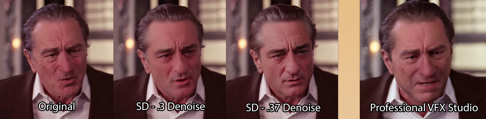
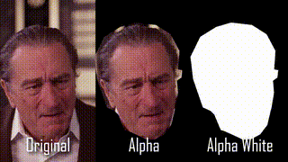
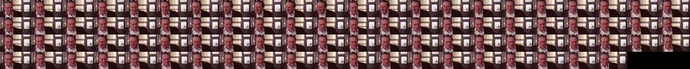
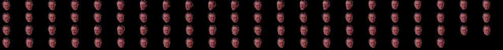
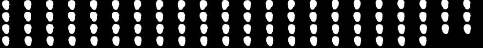
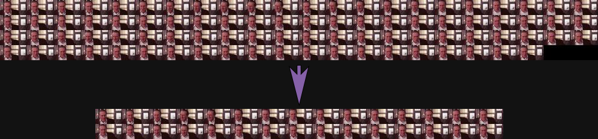
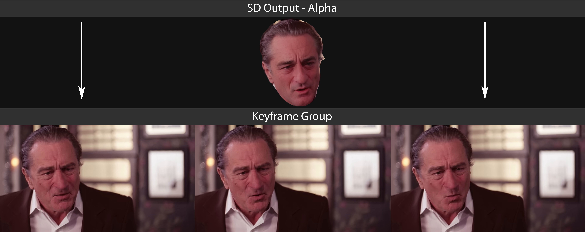

In progress test project to automate the process of ***inpainting a video*** with pre-trained Stable Diffusion inpainting models. Video inpainting usually refers to the processes of filling in missing or damaged parts of a video, removing objects in a video, or changing the style/appearance of objects in a video (e.g., changing an actor's age from old to young or changing a person's clothes from modern to 19th century).

# Video Inpainting

- [A curated list of inpainting papers and resources](https://github.com/zengyh1900/Awesome-Image-Inpainting)
- [Beyond the Field-of-View: Enhancing Scene Visibility and Perception with Clip-Recurrent Transformer](https://arxiv.org/pdf/2211.11293.pdf)
- [PyTorch implementation of FlowLens](https://github.com/MasterHow/FlowLens)
- ["Towards An End-to-End Framework for Flow-Guided Video Inpainting" (CVPR2022)](https://github.com/MCG-NKU/E2FGVI)
- [[CVPR 2022] Inertia-Guided Flow Completion and Style Fusion for Video Inpainting](https://github.com/hitachinsk/ISVI)
- [[ECCV 2022] Flow-Guided Transformer for Video Inpainting](https://github.com/hitachinsk/FGT)
- [[ICCV 2021]: IIVI: Internal Video Inpainting by Implicit Long-range Propagation](https://github.com/Tengfei-Wang/Implicit-Internal-Video-Inpainting)
- [video-object-removal](https://github.com/zllrunning/video-object-removal)
- [[ECCV'2020] STTN: Learning Joint Spatial-Temporal Transformations for Video Inpainting](https://github.com/researchmm/STTN)

# Process

### Mask/Segment Input Video

 details 

- Extract frames
- Use AI like 
    - Facebook's [Segment Anything](https://github.com/facebookresearch/segment-anything)
    - [RemBG batch process with automatic1111's SD interface](https://github.com/AUTOMATIC1111/stable-diffusion-webui-rembg)
    - [Clothing Segmentation](https://github.com/levindabhi/cloth-segmentation)
- Get and store alpha frames
- Create **alpha white** frames by making copies of alpha frames and applying ultra-high gamma-correction  
- Fortunately, the mask can be imperfect (whether too small or too large — as in the example above) and it generally won't degrade inpainting results (in certain cases it might even improve them)
- If user can't find appropriate model for the thing they need to mask/segment, they must manually create the **alpha** and **alpha white** versions of their videos
    - Use automated motion tracking features/plug-ins of professional NLE programs like [After Effects](https://helpx.adobe.com/after-effects/using/rigid-mask-tracking.html) (~10mins for a 30sec. video)
    - [Manually mask the video in a video editor and animate/track the mask frame by frame](https://helpx.adobe.com/premiere-pro/using/masking-tracking.html) (~20mins for a 30sec. video) 
    - Extract all frames and use photo editor like Photoshop to auto-select subjects/backgrounds and manually create mask frames (~1hour for a 30sec. video)

### Extract Frames

  

### Upscale and Interpolate Frames

 details 

- won't interfere with SD because using white mask
- optional
- frame interpolation
- enhancement or upscaling based on user config
    - default model: R-Esrgan 4x
    - multi-model with opacity layering

### Determine Keyframes
based on relative motion/color changes in the **alpha frames** (masked area):

 details 

- determine keyframes based on the frames of the alpha video using algorithm with optional user preferences (use the alpha video because differences in inpainted area are what's important -- i.e., if the overall scene is changing a lot but the inpainted area is not, there's no reason to set a keyframe, because we are not changing anything outside of the inpainted area)
    - Default algorithm
        - calculates color difference and motion difference inside of masked area across frames
        - frames that exceed average color difference and motion difference (plus or minus weights) are designated as keyframes
            - frames are compared with the most recent *keyframe*, rather than the previous frame
    - User input sliders (or config) affect the weights in the project config
        - movement in masked area slider
            - more movement -> smaller keyframe group -> difference threshold weights lowered
            - static objects / less movement -> larger keyframe group -> difference threshold weights highered
        - inpainting model and prompt's tendency to converge
            - more determinstic -> more keyframes creates less punishment (i.e., interframe differences not associated with organic movement/change present in original video) ->  smaller keyframe groups
            - less determinstic -> larger keyframe groups -> higher difference thresholds for keyframe
    - (potential) pre-trained keyframe extraction models
    - (potential) keyframe extraction librariers/plug-ins
- once keyframes are determined, put keyframes from (1) the original video and (2) the alpha WHITE video into separate folders

### Inpaint Keyframes
with Stable Diffusion (SD) 

*picture demonstrates how SD inpainting compares with [professional VFX company's de-aging done for the movie "The Irishman"](https://youtu.be/OF-lElIlZM0?t=209)*

 details 

- run SD on the original-keyframe / WHITE-masked-keyframe pairs
    - specify in SD interface options to create composites only 
    - from user config: denoising (default: .3), model (default: objective reality inpainting), SD model (default: 1.5), resizing (default: 1), batch number/size (default: 4/2)
- separate and store combined outputs and ***mask composites*** from SD outputs

### Select Best Outputs
from each batch (assuming multiple batches were run for each keyframe). E.g., in the above picture, choose between the .3 Denoise and the .37 Denoise outputs

 details 

- GUI user-selection/correction process
    - choose 1 output from each batch
    - manually re-do any problematic keyframes (wherein none of the outputs are acceptable)
        - option to just delete entire keyframe group (perfection not necessary)

### Composite Output Alpha Layers with their Keyframe Groups

 details 

- composite inpainted alpha layers with their associated keyframe groups (including keyframe itself) of the original video
    - blending parameters/mode determination algorithm

### Upscale and Correct Composites

with selected upscaling models and segmentations

 details 

- Layer multiple upscaling outputs with varying opacity 
- or re-segment and upscale by segment, changing model accordingly
- manually spot-healing brush any problematic frames at this point

### Identify Problematic Keyframe Groups
by re-running frame analysis to validate that motion and color differences between frames is similar to the original video. 

Delete (or manually re-create) any problematic frames 

 details 

- This step *shouldn't* be necessary if inter-frame communication is enabled
- Problematic keyframe groups may result from either 
    - bad diffusion results or 
    - oversized keyframe groups. 
- It's better to just delete problematic keyframe groups than to leave them in because, visually, frame drops are better than jarring changes in the subject across short frame distances
- In the case of deletion (rather than re-creation), interpolate blended or generated frames to compensate for deleted frames. 

### Create Video
with the composite frames, slightly lowering speed and blending frames near keyframes

 details 

- stich all blended frames together
    - frame-blending type and options from config
    - output FPS from config
    - video filter options from config

### Interpolate Frames
generate and interpolate frames to improve motion (generalized AI video enhancement process)

 details 

- optionally, video enhancement models
- optionally, frame interpolation

### Enhance, Filter, Overlay Video
based on user config

 details 

- enhance video
    - color correction
    - gamma correction
    - auto levels
    - auto brightness
    - auto exposure
- filter video
    - based on user config
- overlay original video at very low opacity
    - for realism
    - based on user config

### Package Results
including video, path, comparison grid video, log

---------------------------------------------------------------------

  

  ## todo

  

### URGENT
- set SD configs
    - ensure composite saving is on
- auto start SD
- interframe communication
- propogation
- joint spatial-temporal transformations
- intertia guided flow completion

### LESS URGENT
- prepend CLIP interrogation
- ID hashes
- shutil over `cp` shell cmd
- OpenCV creating 2 less frames than FFmpeg 

### OPTIONAL FEATURES
- ....  

  

  
  ## resources

  

### Auto-Keyframe Extraction
- https://github.com/keplerlab/katna

### Motion Detection
- https://github.com/zhearing/moving_target_segment
- https://github.com/WillBrennan/MotionDetector
- https://github.com/JakubVojvoda/motion-segmentation

### Frame Difference
- https://github.com/qbxlvnf11/frame-difference-SSIM/blob/main/Frame_difference_SSIM.ipynb
##### Structural Similarity 
- https://scikit-image.org/docs/stable/api/skimage.metrics.html#skimage.metrics.structural_similarity

### Upscaling CLIs/interfaces
- https://github.com/upscayl/upscayl-ncnn

### Stable Diffusion Interfaces
- 

### CLIP

> “None of us are perfect, for which reason we should heed the voice of charity when it whispers in our ears, "Do not magnify the imperfections of others.”
> 
> &nbsp; &nbsp; ― Elizabeth Keckley